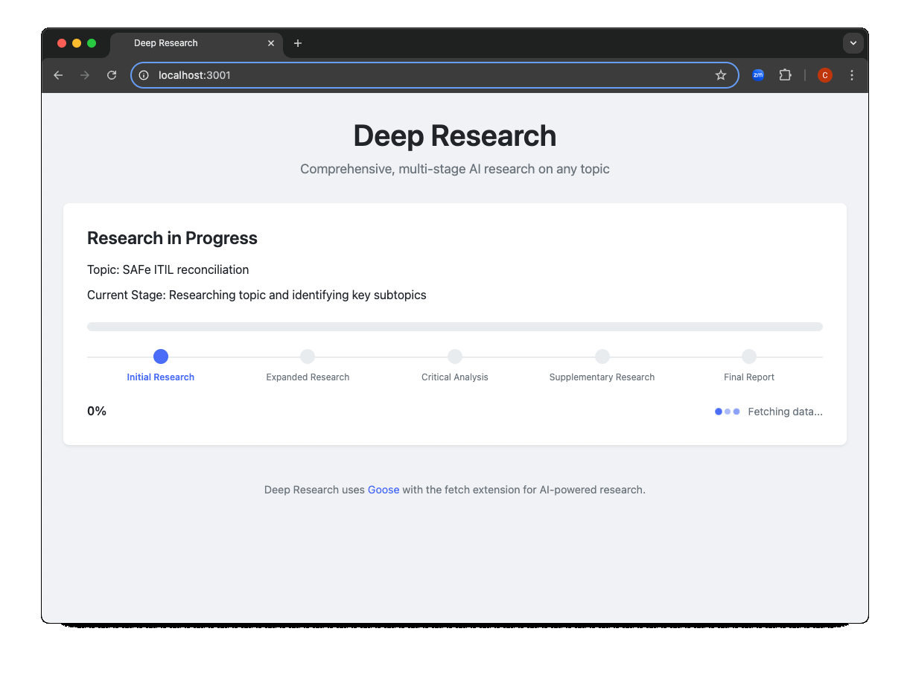

# Deep Research App

A web application that automates multi-stage research using the Goose CLI tool. This app mimics OpenAI's "Deep Research" feature, allowing users to input a research topic and receive a comprehensive, beautifully formatted report.



## Features

- **Simple Interface**: Input a research topic and get a detailed report
- **Multi-Stage Research Process**:
  1. Initial Research - Identify key subtopics
  2. Expanded Research - Explore subtopics in depth
  3. Critical Analysis - Critically evaluate findings
  4. Supplementary Research - Fill research gaps
  5. Final Report - Generate comprehensive report
- **Real-time Progress Tracking**: Visual indicators for each stage
- **Elegant Markdown Rendering**: Clean display of research reports with syntax highlighting
- **Responsive Design**: Works on desktop and mobile devices

## Prerequisites

- [Node.js](https://nodejs.org/) (v14 or later)
- [Goose CLI](https://github.com/goose-ai/goose) with the fetch extension (`uvx mcp-server-fetch`)

## Installation

1. Clone the repository:
   ```bash
   git clone <repository-url>
   cd deep-research-app
   ```

2. Install dependencies:
   ```bash
   npm install
   ```

3. Create a `.env` file based on `.env.example`:
   ```bash
   cp .env.example .env
   ```

4. Edit the `.env` file to configure your environment:
   ```
   # Server Configuration
   PORT=3000
   NODE_ENV=development

   # Goose CLI Configuration
   GOOSE_PATH=goose
   TEMP_DIR=/tmp/deep-research
   RESEARCH_SESSION_PREFIX=deep-research

   # Extensions
   GOOSE_EXTENSIONS=uvx mcp-server-fetch
   ```

## Running the App

1. Start the server:
   ```bash
   npm start
   ```

2. Open your browser and navigate to:
   ```
   http://localhost:3000
   ```

3. Enter a research topic in the input field and click "Begin Research"

## Docker Support

To run the app using Docker:

1. Build the Docker image:
   ```bash
   docker build -t deep-research-app .
   ```

2. Run the container:
   ```bash
   docker run -p 3000:3000 deep-research-app
   ```

3. Access the app at http://localhost:3000

## Project Structure

```
deep-research-app/
├── frontend/            # Frontend assets
│   ├── index.html       # Main HTML file
│   ├── css/             # CSS styles
│   └── js/              # JavaScript files
│
├── backend/             # Backend server
│   ├── server.js        # Express server
│   ├── research/        # Research handling
│   │   ├── goose.js     # Goose CLI wrapper
│   │   ├── orchestrator.js # Research orchestration
│   │   └── templates/   # Research templates
│   └── utils/           # Utilities
│
├── shared/              # Shared between frontend and backend
│   └── constants.js     # Shared constants
│
├── .env.example         # Environment variable template
├── Dockerfile           # Docker configuration
└── package.json         # Dependencies and scripts
```

## Future Extensions

- **User accounts**: Save research history
- **Export options**: Download reports as PDF or markdown
- **Advanced configuration**: Customize research parameters
- **Additional research sources**: Integrate more data sources

## License

MIT
